# 📊 Sơ Đồ UML & Kiến Trúc - E-Commerce BE-Learning

## 1. Biểu Đồ UseCase Chi Tiết (Mermaid)

### 1.1 UseCase Toàn Hệ Thống

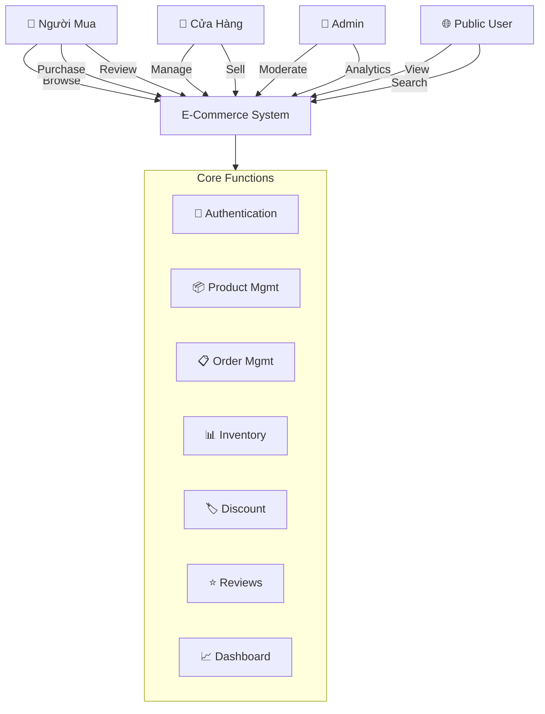

### 1.2 UseCase: Quy Trình Mua Hàng

```mermaid
graph LR
    A["👤 User"] -->|Sign In| B["🔐 Authenticated"]
    B -->|Browse Products| C["📦 Product List"]
    C -->|View Detail| D["📖 Product Detail"]
    D -->|Add to Cart| E["🛒 Shopping Cart"]
    E -->|Review Items| F["✓ Confirm Order"]
    F -->|Apply Discount| G["💰 Calculate Total"]
    G -->|Select Address| H["📍 Delivery Address"]
    H -->|Choose Payment| I["💳 Payment"]
    I -->|Confirm| J["✅ Order Created"]
    J -->|Track| K["📫 Order Status"]
    K -->|Delivery| L["🎁 Received"]
    L -->|Review| M["⭐ Add Review"]
    M -->|Complete| N["✔️ Done"]
```

### 1.3 UseCase: Quy Trình Bán Hàng (Shop)

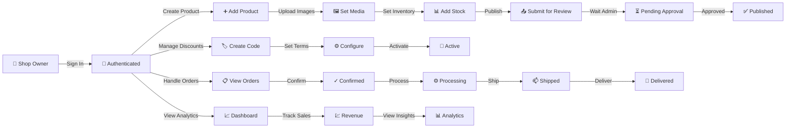

### 1.4 UseCase: Admin Moderation

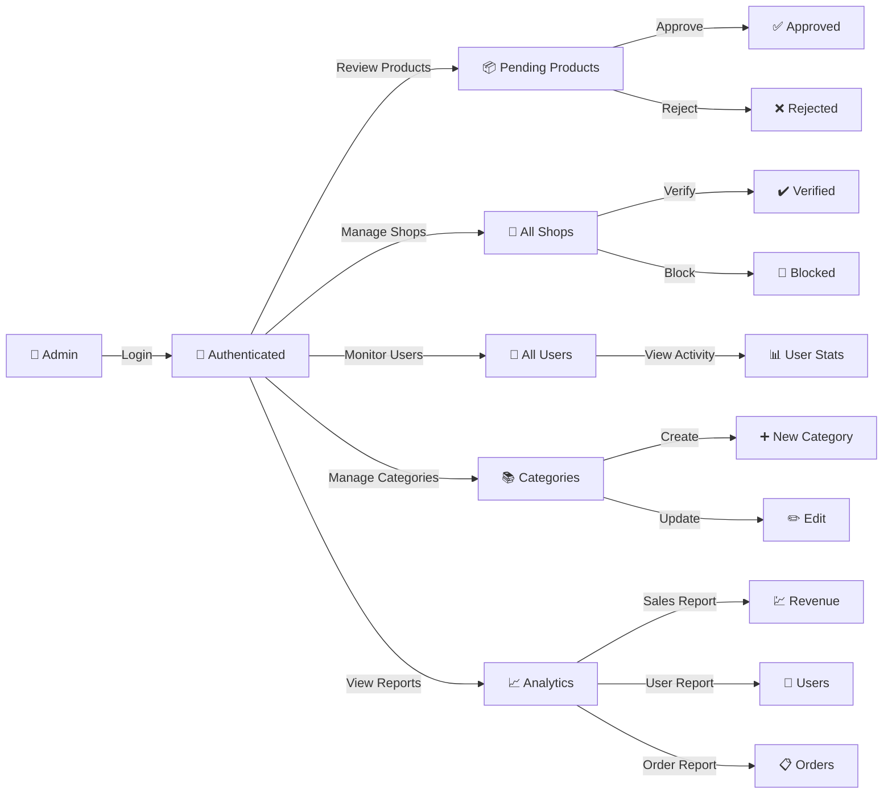

---

## 2. Biểu Đồ Chuỗi (Sequence Diagram)

### 2.1 Luồng Tạo Đơn Hàng (Order Creation Flow)

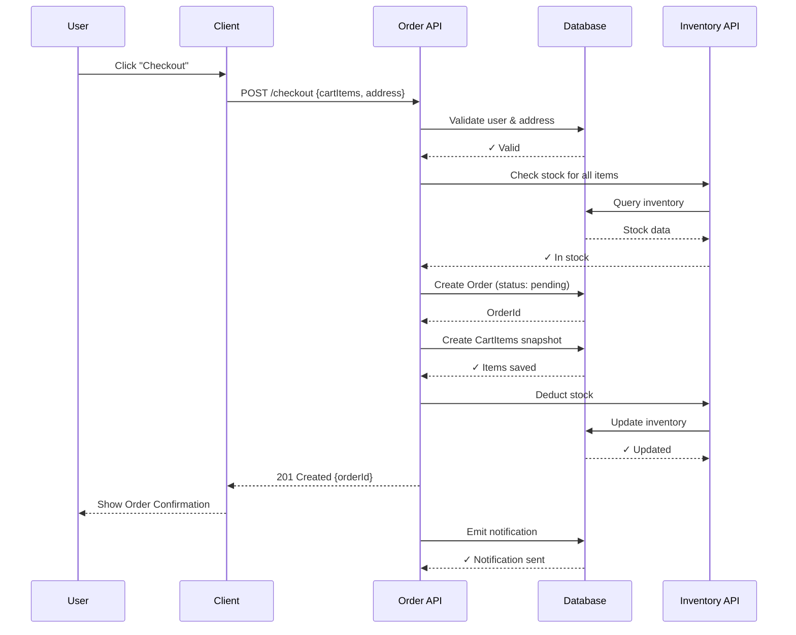

### 2.2 Luồng Xác Nhận Đơn (Order Confirmation by Shop)

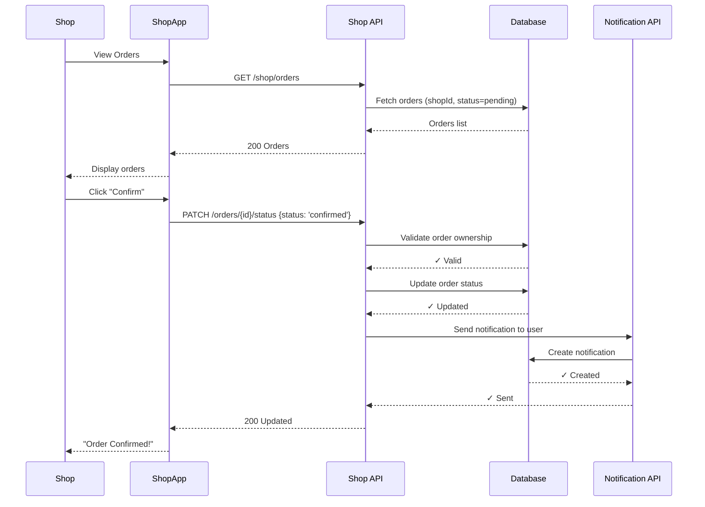

### 2.3 Luồng Thanh Toán Giảm Giá (Discount Application)

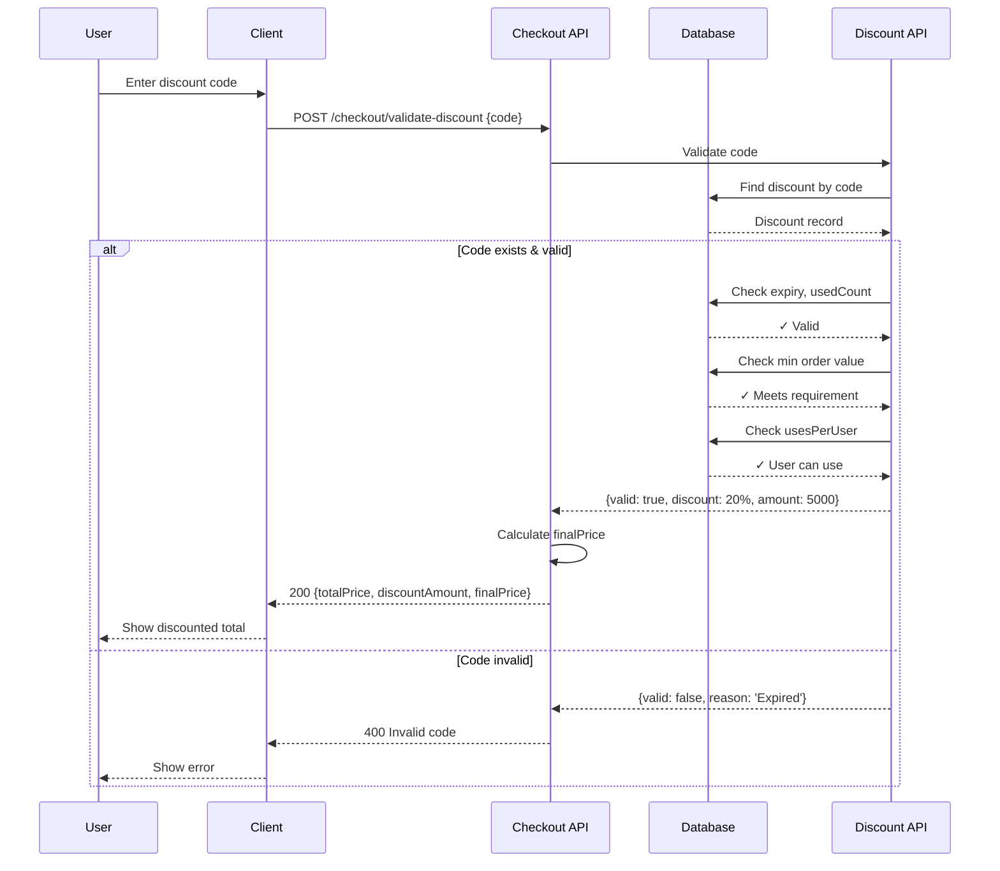

### 2.4 Luồng Đánh Giá Sản Phẩm (Review Creation)

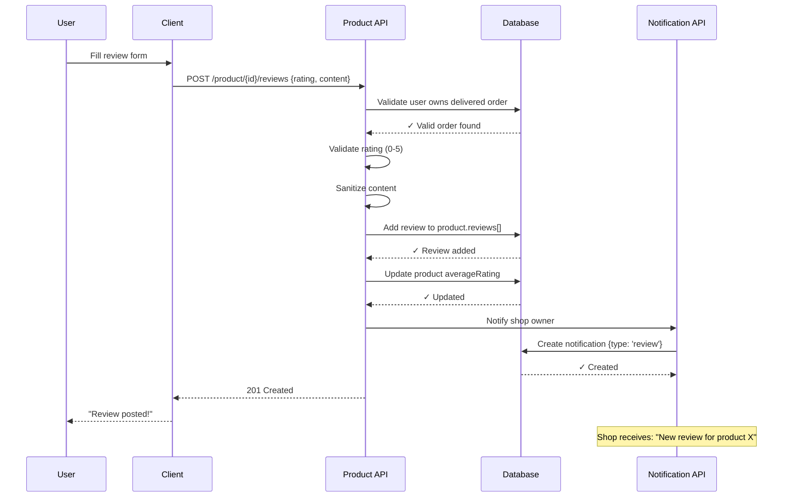

### 2.5 Luồng Phê Duyệt Sản Phẩm (Admin Approval)

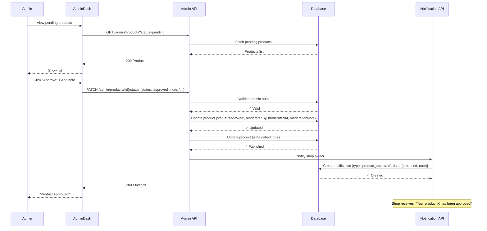

---

## 3. Class Diagram (Kiến Trúc Hệ Thống)

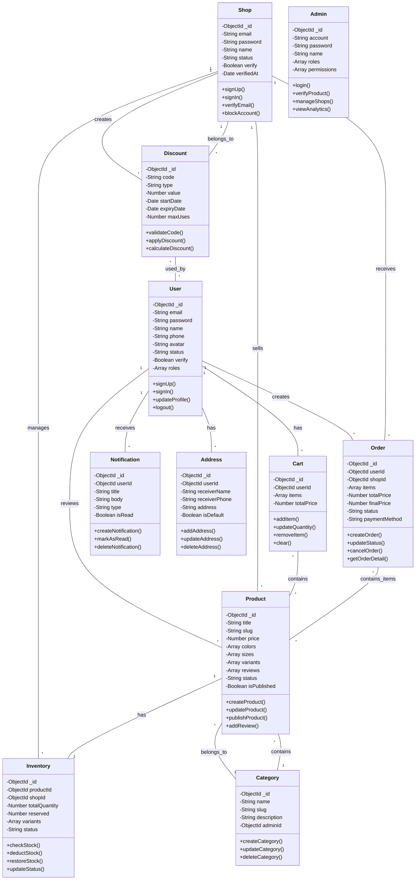

---

## 4. Biểu Đồ Trạng Thái (State Diagram)

### 4.1 Order Status Flow

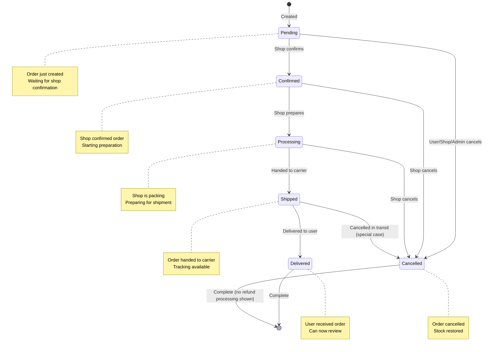

### 4.2 Product Status Flow

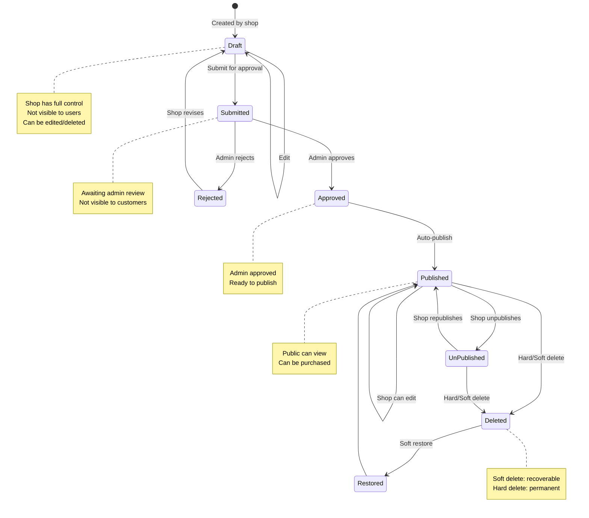

### 4.3 Shop Status Flow

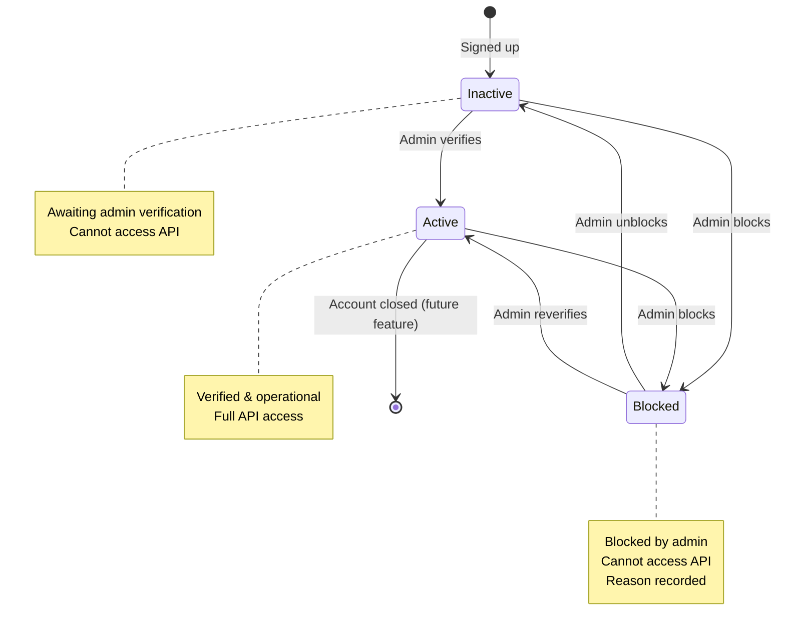

---

## 5. Component Diagram (Kiến Trúc Hệ Thống)

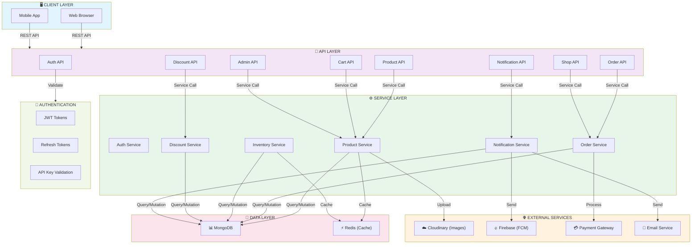

---

## 6. Data Flow Diagram (DFD)

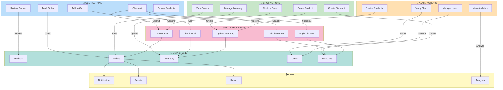

---

## 7. Biểu Đồ Mối Quan Hệ Chi Tiết (Detailed Relationship)

### 7.1 Product - Variant - Inventory Relationship

```mermaid
graph TB
    subgraph Product_View ["📦 PRODUCT LEVEL"]
        P["Product"]
        P -->|has| Colors["Colors[]"]
        P -->|has| Sizes["Sizes[]"]
        Colors -->|R,G,B| Color1["Color 1"]
        Color1 -->|combinations| Var["Variants[]"]
    end
    
    subgraph Variant_View ["🎨 VARIANT LEVEL"]
        V1["Variant"]
        V1 -->|Color: Red| C["color: 'Red'"]
        V1 -->|Size: M| S["size: 'M'"]
        V1 -->|Stock in Product| Stock1["stock: 10"]
    end
    
    subgraph Inventory_View ["📊 INVENTORY LEVEL"]
        I["Inventory"]
        I -->|Total| Total["totalQuantity: 50"]
        I -->|Mirror| Variants2["variants[]"]
        Variants2 -->|Mirror| V2["color, size, stock"]
    end
    
    Var -.->|Mirror| Variants2
    V1 -.->|Points to| V2
    
    Note over Product_View,Variant_View,Inventory_View
        Each (Color + Size) = 1 Variant
        Inventory mirrors Product.variants for tracking
        Deduction happens at Inventory, not Product
    end
```

### 7.2 Order - CartItem - Product Relationship

```mermaid
graph TB
    subgraph Order_Time ["📋 AT ORDER TIME"]
        Order["Order"]
        Order -->|contains| Items["items[]"]
        Items -->|snapshot| Item["OrderItem"]
        Item -->|productId| PID["Product ID"]
        Item -->|variantId| VID["Variant ID"]
        Item -->|price| Price["Price (frozen)"]
        Item -->|quantity| Qty["Quantity"]
    end
    
    subgraph Later ["⏳ LATER (Price Changes)"]
        Product_Later["Product (updated)"]
        Product_Later -->|price| NewPrice["$100"]
        Order -->|STILL HAS| OldPrice["$80"]
    end
    
    Note over Order_Time,Later
        Order snapshots prices at creation time
        Prevents price disputes later
        If product price changes, order is unaffected
    end
```

---

## 8. Deployment Architecture

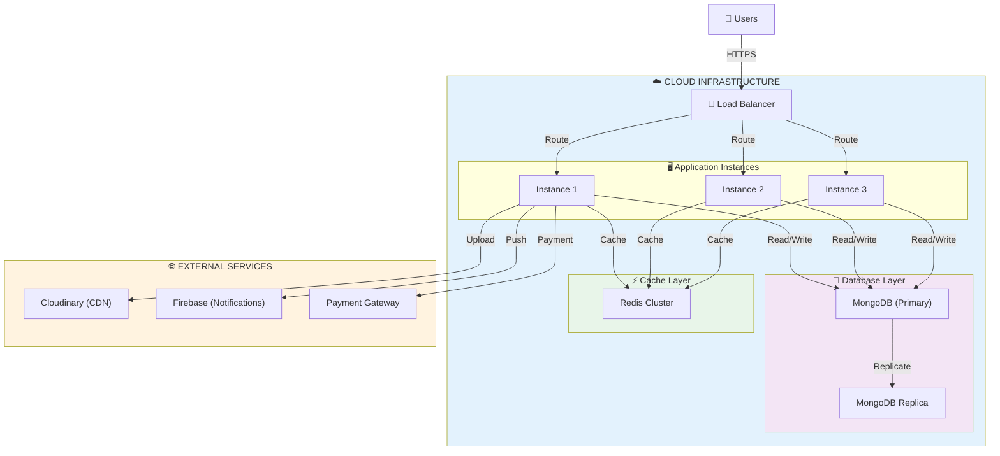

---

**Lưu ý:** 
- Các sơ đồ Mermaid trên có thể được render trong GitHub, GitLab, hay các tool hỗ trợ Mermaid khác
- Để xem các biểu đồ interactively, sử dụng [Mermaid Live Editor](https://mermaid.live)

---

**Cập Nhật Lần Cuối:** 18 Tháng 5, 2026
**Phiên Bản:** 1.0.0
